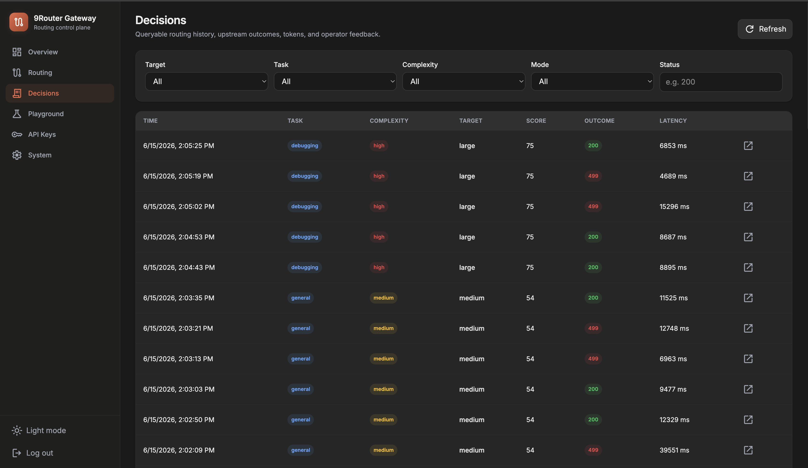

<p align="center">
  
</p>

<h1 align="center">9Router Gateway</h1>

9Router Gateway sits between an AI client and [9Router](https://github.com/decolua/9router). It accepts OpenAI-compatible and Anthropic requests, chooses a 9Router model or combo for virtual models such as `auto`, then forwards the request upstream.

```text
AI client -> 9Router Gateway :20129 -> 9Router :20128 -> provider
```

9Router still owns provider credentials, account rotation, quota handling, format translation, and provider fallback. The gateway handles request classification, routing policy, conversation affinity, history, and operator controls.

## Quick start

Requirements:

- Node.js 22 or newer
- A running 9Router instance
- The five default 9Router models or combos: `smart-small`, `smart-medium`, `smart-planning`, `smart-large`, and `smart-vision`

Install and start the gateway:

```bash
npm install
npm run build:ui
cp config.example.yaml config.yaml
cp .env.example .env
npm start
```

Open `http://127.0.0.1:20129/dashboard`. The initial admin password is `smart9router`. Change it from the System page or from the command line:

```bash
npm run admin:set-password -- 'a-new-password'
```

The password is stored in `data/router.sqlite` and survives restarts.
The built-in dashboard is always enabled and is not configurable.

Point clients to:

```text
OpenAI-compatible base URL: http://127.0.0.1:20129/v1
Anthropic Messages endpoint: http://127.0.0.1:20129/v1/messages
```

Select `auto`, `auto-fast`, or `auto-quality` as the model. Requests using an explicit 9Router model or combo pass through unchanged.

## How routing works

The default mapping is:

| Work | Default target |
| --- | --- |
| Short transformations and simple requests | `smart-small` |
| Coding, debugging, review, and research | `smart-medium` |
| Architecture and planning | `smart-planning` |
| Security, risky migrations, and complex production work | `smart-large` |
| Requests containing images | `smart-vision` |

Routing starts with deterministic request signals, including English and Indonesian intent and risk terms. Ambiguous requests can use the pinned DeBERTa zero-shot classifier configured in `config.yaml`. A timeout, classifier error, or low-confidence result falls back to deterministic routing.

Conversation affinity prevents a session from being downgraded after it has used a stronger target. Send `x-smart-router-session-id` when the client has a stable conversation identifier. The gateway also recognizes common session fields in request bodies and can derive a privacy-safe fallback fingerprint.

Shadow mode records the target the router would have selected while sending virtual-model requests to `routing.shadowTarget`. Use it to evaluate routing policy before enabling active dispatch.

When strict model validation is enabled, automatic routing fails closed if the configured target does not exist in the current 9Router `/v1/models` catalog. Set `upstream.strictModelValidation: false` only when that behavior is not wanted, such as local development.

## Configuration

The main configuration file is `config.yaml`. Start from `config.example.yaml`.

Configuration is applied in this order:

```text
defaults < config.yaml < data/runtime-config.json < environment variables
```

Dashboard changes are written atomically to `data/runtime-config.json` and apply to new requests without a restart. Values controlled by environment variables appear locked in the dashboard.

Common environment variables are listed in `.env.example`:

- `NINEROUTER_BASE_URL` points to the upstream 9Router server.
- `NINEROUTER_API_KEY` is used for background model-catalog requests when 9Router requires authentication.
- `SMART_ROUTER_CONFIG` selects the configuration file.
- `SMART_ROUTER_DATA_DIR` selects the persistent data directory.
- `SMART_ROUTER_HOST` and `SMART_ROUTER_PORT` control the listener.
- `SMART_ROUTER_API_KEY_AUTH_ENABLED` can lock client API-key enforcement from the environment.

The existing `SMART_ROUTER_*`, `x-smart-router-*`, and `smart_router_*` names are retained for compatibility.
`SMART_ROUTER_CLASSIFIER_ENABLED` is optional; setting it explicitly locks the semantic-classification toggle to that value.
`SMART_ROUTER_CLASSIFIER_MIN_CONFIDENCE` is optional; setting it explicitly locks the minimum-confidence field to that value.

`npm start`, `npm run dev`, and utility scripts load `.env` when it exists. Values already exported by the shell take precedence.

## Client API keys

API-key enforcement is optional. Enable **Require API key** on the API Keys page or set `SMART_ROUTER_API_KEY_AUTH_ENABLED=true`.

The dashboard can create multiple named keys with an expiration of one day, seven days, 30 days, 90 days, or never. Each key can be enabled, disabled, shown, copied, or permanently deleted.

Send a key with either header:

```http
Authorization: Bearer sk-...
```

```http
x-api-key: sk-...
```

When enforcement is enabled, requests under `/v1/` are rejected without a valid active key, except the operator routes under `/v1/router/`.

Keys are hashed for request verification. Newly created keys are also stored in SQLite so the authenticated dashboard can show and copy them after a restart. Keys created by older versions may remain valid but display as unavailable because their original value cannot be recovered from the hash.

## Dashboard

The dashboard includes:

- Request volume, target distribution, latency, token use, and subsystem health
- Routing targets, thresholds, profile bias, shadow mode, classifier, affinity, logging, and retention controls
- Searchable decision history with request context, outcomes, signals, and operator feedback
- A dry-run playground for OpenAI Chat, OpenAI Responses, and Anthropic Messages requests
- Named API-key management and global API-key enforcement
- Model-catalog refresh, effective configuration sources, password management, decision reset, and runtime override reset

Dashboard login creates an in-memory `HttpOnly`, `SameSite=Strict` session. Mutations require a CSRF token, and failed login attempts are rate-limited by client address.

## HTTP endpoints

The gateway proxies `/v1/chat/completions`, `/v1/responses`, `/v1/messages`, `/v1/models`, and other 9Router routes. The model list adds:

- `auto`
- `auto-fast`
- `auto-quality`

Routed responses include:

- `x-smart-router-request-id`
- `x-smart-router-target`
- `x-smart-router-dispatch-target`
- `x-smart-router-task`
- `x-smart-router-complexity`
- `x-smart-router-confidence`
- `x-smart-router-mode`

Operator endpoints:

- `POST /v1/router/explain` previews a decision without dispatching or changing affinity.
- `POST /v1/router/feedback` stores a rating from 1 to 5 with optional expected target and note.
- `GET /metrics` returns Prometheus metrics.
- `GET /healthz` reports process health.
- `GET /readyz` reports model-catalog readiness.

The router operator endpoints and metrics accept the admin password as a bearer token:

```bash
curl http://127.0.0.1:20129/v1/router/explain \
  -H "Authorization: Bearer smart9router" \
  -H "Content-Type: application/json" \
  -d '{"request":{"model":"auto","messages":[{"role":"user","content":"Plan an API migration"}]}}'
```

The `/api/admin/*` endpoints are intended for the dashboard and use its session cookie and CSRF token.

## Data and operations

Persistent state lives under `data/` by default:

- `router.sqlite` stores the admin password, API keys, decisions, outcomes, and feedback.
- `runtime-config.json` stores dashboard configuration overrides.
- `decisions.jsonl` and `feedback.jsonl` remain available for evaluation tooling.
- `models/` stores the classifier cache.

SQLite uses WAL mode. History retention is configurable. Raw prompt storage is disabled by default.

Run the offline routing evaluation with:

```bash
npm run evaluate
```

Refresh and validate the upstream model catalog with:

```bash
npm run smoke:upstream
```

## Docker

Create `config.yaml`, then start both services:

```bash
cp config.example.yaml config.yaml
docker compose -f docker-compose.example.yml up --build
```

The example Compose file runs this service as `gateway` and 9Router as `9router`. Keep the `gateway-data` volume if passwords, API keys, history, and classifier files must survive container replacement.

Build the image directly with:

```bash
docker build -t 9router-gateway .
```

The image builds the dashboard in a separate stage and ships only the production server and compiled UI.

## Development

```bash
npm run dev
npm run dev:ui
npm test
npm run check
```

The test suite covers request normalization, routing policy, affinity, configuration revisions, sessions and CSRF, SQLite persistence, API-key authentication, static UI headers, and end-to-end proxy behavior with a fake 9Router server.

## License

9Router Gateway is released under the [MIT License](LICENSE).
